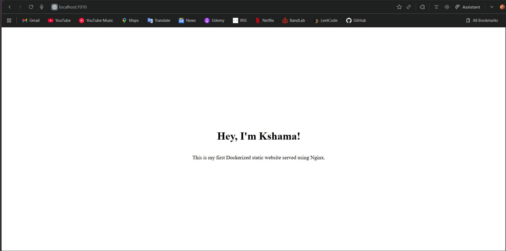

# Assignment 1 – Personalized Web Server Container

## Goal
Create a Dockerized static website served using Nginx, accessible on port 7070.

## Files
- `index.html` – simple static page with my name, heading and description.
- `Dockerfile` – builds an image based on the official `nginx:alpine` image and serves `index.html`.

## Build Image

```bash
docker build -t kshama-site .

```

## Create a container to run it on port 7070

```bash
docker run -d --name my-site -p 7070:80 kshama-site

```

## Output
